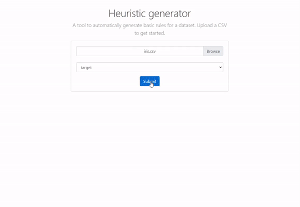

# auto-heuristic

[](https://codecov.io/gh/BenAAndrew/auto-heuristic)

## [Live demo](https://heuristic-generator.herokuapp.com/)



## What is a heuristic?
Heuristics are "rules of thumb" designed to find an approximate solution to a complex problem. 

Often we may want to create a set of rules which fit most cases for a dataset. However, it can be time consuming to explore the dataset and decide the best rules by hand.

## What is the purpose of this app?
This app automatically generates a set of rules to classify a dataset. It then generates Python or JS code which you can quickly implement to add this behaviour. 

For example, the app produces the following Python code to correctly classify the [iris dataset](https://github.com/BenAAndrew/auto-heuristic/blob/main/tests/test_files/iris.csv) 100% of the time:

```
def predict(petal_width, petal_length):
    if petal_length <= 2.45:
        return "setosa"
    else:
        if petal_length <= 4.75:
            if petal_width <= 1.65:
                return "versicolor"
            else:
                return "virginica"
        else:
            if petal_width <= 1.75:
                return "versicolor"
            else:
                return "virginica"
```

## How it works
Using a [DecisionTreeClassifier](https://scikit-learn.org/stable/modules/generated/sklearn.tree.DecisionTreeClassifier.html) the app automatically explores a variety of tree depths to identify the best trade off between accuracy and complexity.

It then converts this decision tree into code so that you can quickly implement it into your codebase.
